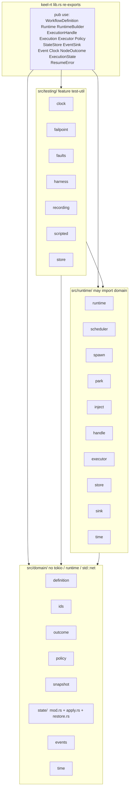
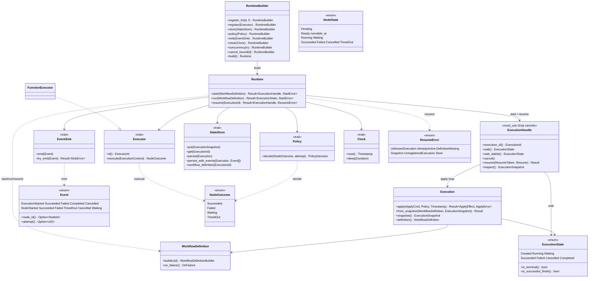

# Keel-rt architecture

Current-thread DAG kernel. One execution = one apply loop + N execute tasks.
No work-stealing, no product resource types, no YAML/HTTP/CLI.

## Modules

```
src/domain/          rules. No tokio, no runtime, no std::net.
  definition.rs      validated DAG; OnFailure + Join live here only
  ids.rs             NodeId / WorkflowId / ExecutionId / ExecutorId / ResumeToken
  outcome.rs         NodeOutcome, Resume, NodeError
  policy.rs          Policy port + Accept / Retry / NeverWait
  snapshot.rs        persistable ExecutionSnapshot (HashMap + definition order)
  state.rs           Execution aggregate + NodeState / ExecutionState
  apply.rs           apply / join / fail-fast / FailSubtree (impl Execution)
  events.rs          Event as data (no EventLog, no NodeReady)
  time.rs            Timestamp value object

src/runtime/         bundle. May import domain. Never imported by domain.
  runtime.rs         Runtime / RuntimeBuilder / StartError / ResumeError
  scheduler.rs       event loop: apply → dispatch → persist → emit. No policy rules.
  spawn.rs           one tokio::spawn per execute; completions are Events
  park.rs            wait for Event or snapshot deadline T (Clock)
  inject.rs          Event + unbounded mpsc (see docs/adr/0001)
  handle.rs          ExecutionHandle; Drop cancels; not Clone
  executor.rs        Executor port, FunctionExecutor, ExecutionContext
  store.rs           StateStore port; MemoryStore / NoopStore
  sink.rs            EventSink port; FnSink / NoopSink
  time.rs            Clock port; SystemClock

src/testing/         feature test-util. Harness + doubles. Not the kernel.
```

**Dependency arrow:** `testing → runtime → domain`. Never reverse. No cycles
between crate modules.

**Public surface** is the crate root (`lib.rs` re-exports). `domain` and
`runtime` are `pub(crate)`. `Execution::apply` is the documented domain API
(used by apply-only benches and stale/timer packs). Inspect live runs through
`ExecutionHandle` / `ExecutionSnapshot`.

These two diagrams are the **committed baseline** for PRs (`AGENTS.md`).
Regenerate from `src/**/mod.rs` + `src/lib.rs` re-exports — do not invent modules
or types.

### (a) Repo / module map



### (b) Public run-loop types

Ports are traits. `Scheduler` / `Park` / `inject::Event` are crate-private and
stay off this diagram.



## Absences (structure tests hold these)

- No Agent, HTTP, SQL, crawl, or HITL **types** in `src/`.
- No `rusqlite` / `postgres` / `sqlx` in the kernel crate or `src/`.
- No `utils` / `common` / `helpers` / `shared`.
- No Runtime-wide FailSubtree or AllDone switch.
- No test-only constructor that builds an illegal `WorkflowDefinition`.
- Waiting is a node state. Retry delay is `Ready { runnable_at }` (Instant T on the snapshot).
- Snapshot is execution state. Definition is data (hash on the snapshot).

File store lives in sibling `crates/keel-rt-sqlite`. It depends on `keel-rt`.
The kernel does not depend on it. Cheap to delete: remove the crate, do not
edit `scheduler.rs`.

## Where to change

| If you are changing…                         | Touch                                      | Do not touch              |
|----------------------------------------------|--------------------------------------------|---------------------------|
| AND-join / AllDone readiness                 | `definition` + `apply` remain-pred         | scheduler                 |
| Fail-fast / FailSubtree                      | `definition` (opt-in) + `apply`            | `RuntimeBuilder`          |
| Retry / reject Waiting                       | a `Policy` impl                            | readiness / park          |
| User work / sleep                            | `Executor` / `ExecutionContext`            | `apply`                   |
| Persist / dirty slots                        | `StateStore` / `MemoryStore`               | scheduler policy          |
| File-backed store                            | `crates/keel-rt-sqlite`                    | `scheduler.rs` / kernel `Cargo.toml` |
| Snapshot resume / CAS                        | `restore.rs` + `Runtime::resume`           | event replay              |
| Cancel, wait, token-resume, inspect          | `handle` + `inject::Event`                 | domain types              |
| Ready-queue / permits / spawn                | `scheduler` + `spawn`                      | `Policy`                  |
| Test graph construction                      | `WorkflowTest`                             | private scheduler fields  |
| Snapshot walk order                          | `ExecutionSnapshot::iter_nodes`            | HashMap `.node(id)`       |

## Apply vs run

- **`Execution::apply`** — synchronous, no I/O. Policy is consulted here.
- **`ApplyEffect`** — public `events` / `changed`. `newly_runnable` and
  `to_abort` are crate-private `NodeSlot` vectors (not on this diagram).
  Apply-only drivers call `newly_runnable_ids(&exec)`. The scheduler enqueues
  and aborts by slot. Public `inputs_for` stays `HashMap<NodeId, Bytes>`.
- **`Runtime::start` / `run`** — fail-fast if an executor id is missing, then
  spawn the apply loop. Drop `ExecutionHandle` cancels (`#[must_use]`).
  `start` always creates a new `ExecutionId`.
- **`Runtime::resume`** — load snapshot + definition, rebuild, re-dispatch
  Ready nodes. Running-at-crash is re-invoked (at-least-once, keyed by
  attempt). See `docs/adr/0004-resume-at-least-once.md`.
- Default `OnFailure` = `FailExecution`. Default `Join` = `AllSucceeded`.

## Bounds

- **Concurrency:** `RuntimeBuilder::concurrency` (permits). In-flight execute
  tasks ≤ that number.
- **Apply inbox:** unbounded mpsc (ADR 0001). Producers are execute tasks +
  handle ops; they must not block on apply. Persist is inline, not a queue.
- **Retry:** `RetryPolicy::max_attempts` is the only retry bound. Delay is Instant
  **T** on `Ready { runnable_at: Some(T) }`, not a wait state and not a sqlite
  timer row. Resume restores T; if `Clock.now() < T` the scheduler parks
  (`Clock::sleep`). If `now() >= T`, `RetryDue` then dispatch (or TimedOut
  when policy Accepts). FakeClock in tests. Drop of the handle aborts the sleeper.
- **Cancel hang:** `cancel_bound` is **wall** time (`tokio::time::sleep`), not
  `Clock`. FakeClock does not stretch it. The sleeper is an `AbortHandle` on
  the scheduler and is aborted in `Drop` (no wake into a dead execution).
  `SpawnSet` Drop aborts leftover execute tasks (JoinSet, not detach).
- **Permits:** held only while a node is `Running`. Waiting releases. Inspect
  via [`ExecutionSnapshot::running_count`] / [`waiting_count`].

## Performance gate

No Criterion crate. The gate is the in-tree harness:

```bash
cargo test --test stress -- --nocapture --test-threads=1
cargo test --test stress_100k -- --nocapture --test-threads=1
cargo test --test stress_uneven -- --nocapture --test-threads=1
```

Numbers live in `benches/BASELINE.md`. A hot-path change that regresses those
medians is a bug: fix or revert and ADR.

This crate does not pick an allocator and has no `jemalloc` feature.
See `benches/JEMALLOC.md` — jemalloc vs sys on `current_thread` was noise;
do not recommend it from those numbers. Jemalloc lives only in a separate
unpublished bench binary (`benches/jemalloc_compare`).

## Coverage gate

`just coverage` / `./scripts/coverage.sh` runs `cargo llvm-cov` on the default
suite (not `stress_100k`). CI fails unless kernel `src/` line coverage is
**100%** (`coverage/BASELINE` allowlist is empty). `src/testing/` does not
count. The sibling store crate is not kernel `src/`.
