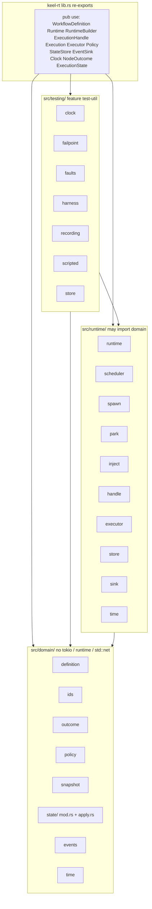
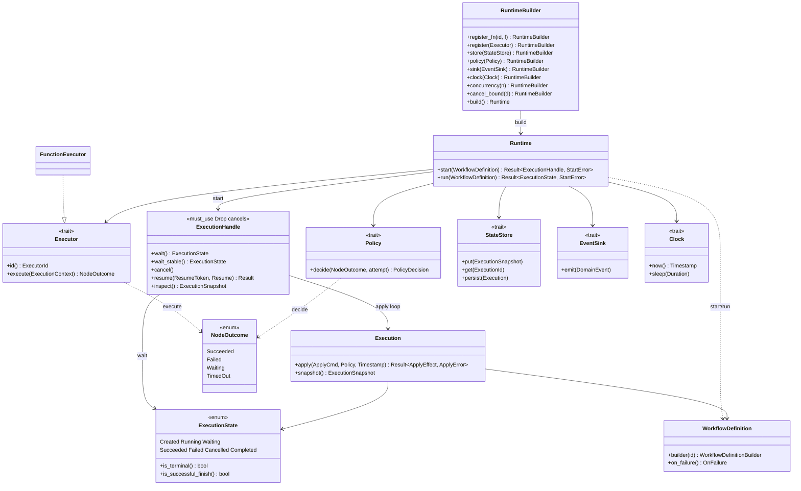

# Phase 1 freeze PR body

Title: **Phase 1: local DAG kernel freeze**

`main` SHA: `5ca1b971c0b21e9259881709b491c0bd7d58bebd`

Origin cannot open a PR whose head and base are both `main`. This branch
adds only freeze docs (`CHANGELOG.md` + this file). Kernel code is unchanged.

This file is the filled `.github/pull_request_template.md` for the first
review of the Phase 1 kernel. Architecture diagrams match
[`ARCHITECTURE.md`](ARCHITECTURE.md). Do not merge `examples/studio`.
Do not flip `FailSubtree` to default. Do not add HTTP/Agent.

---

## Architecture (before)

First-PR baseline. There is no prior tree to diff against: this `main` *is*
the kernel. The committed baseline is [`docs/ARCHITECTURE.md`](ARCHITECTURE.md)
(repo map + Runtime/Execution class diagram). Those mermaids:

## Architecture (after)

**After = before.** Same two diagrams as `docs/ARCHITECTURE.md` (this freeze
does not split modules or add product types). Real deltas vs an empty first
sketch, not vs a second diagram:

- `domain` and `runtime` are `pub(crate)`; public surface is `lib.rs` re-exports.
- Apply lives in `src/domain/state/apply.rs` (state module split); `Execution::apply` stays the domain API.
- `ExecutionSnapshot::running_count()` / `waiting_count()` are public in-flight observability (Running holds a permit; Waiting does not). Not drawn as extra classes — they are methods on the existing snapshot type.
- Scheduler / park / inject / spawn stay crate-private (off diagram (b)).
- No `jemalloc` crate feature; library never sets `#[global_allocator]`.

## User behavior (when X, used to Y, now Z)

Phase 1 public path (greenfield: “used to” is the naive / earlier-hole
behavior; “now” is frozen `main`).

- When a caller **starts a workflow** with `Runtime::start`, it used to spawn
  the apply loop even if an executor id was missing (that node failed later
  or hung). Now `start` / `Runtime::run` returns
  `StartError::UnregisteredExecutors` (ids named) and **nothing runs**.
- When a caller only needs the terminal state, it used to hold
  `ExecutionHandle` and risk Drop-cancel. Now they call `Runtime::run`
  (start + wait; no handle).
- When a caller registers a function executor, it used to construct
  `FunctionExecutor` by name. Now `RuntimeBuilder::register_fn` is the usual
  path; `register(impl Executor)` remains.
- When a caller runs **wait**, it used to return only on terminal
  (`Succeeded` / `Failed` / `Cancelled` / `Completed`). Now it still does.
  Waiting is not done.
- When a caller needs to resume a parked graph, it used to have no stable
  wait. Now they `wait_stable` then `resume`. If the scheduler dies without
  a terminal publish, wait / wait_stable used to return the last watch value
  (`Created` / `Running` / `Waiting`). Now they return `Cancelled`, matching
  inspect’s stopped snapshot.
- When a caller **drops `ExecutionHandle`** (or calls **cancel**), it used to
  cancel the graph (not detach). Now it still does. The handle is not
  `Clone`. `#[must_use]`. JoinSet execute tasks and the cancel-bound sleeper
  abort on Drop; permits return (Running, Waiting, mid-timer).
- When a caller **cancels after the execution is already terminal**, it used
  to apply `Cancel` and rewrite `Succeeded` / `Failed` to `Cancelled`. Now
  cancel is a **no-op** on a terminal execution.
- When a caller **resumes** a Waiting node, it used to `Complete` or
  `Reinvoke` by token. Now it still does. Duplicate equivalent Complete is a
  no-op; conflicting Complete errors; **resume after cancel errors**.
- When a caller runs **fail** (executor `Failed` / `TimedOut`, policy Accept),
  it used to fail-fast the whole execution. Now it still does:
  `OnFailure::FailExecution` is the library default. `FailSubtree` and
  `Join::AllDone` remain **definition-only opt-in** (not a Runtime switch).
  A leaf that fails under FailSubtree still `Completed` the execution.
  `ExecutionState::is_successful_finish()` is true for Succeeded **and**
  Completed.
- When a caller runs **retry**, it used to become `Ready { runnable_at }`,
  never Waiting. Now it still does. Waiting still releases the permit.
- When a caller runs **inspect**, it used to return an `ExecutionSnapshot`
  keyed by `NodeId` (HashMap walk). Now `.node(id)` is unchanged and
  `iter_nodes()` is **definition order**. `running_count()` / `waiting_count()`
  are the in-flight observability. After scheduler death, inspect is the
  stopped snapshot (`Cancelled`).
- When a caller builds a definition with an **empty** workflow id, node id,
  or executor id, it used to succeed. Now `build` returns
  `DefinitionError::EmptyWorkflowId` / `EmptyNodeId` / `EmptyExecutorId`.
- When a caller sets a process allocator via this crate, it used to have no
  hook (and briefly an unused `jemalloc` feature). Now the crate **does not
  pick an allocator**, has **no `jemalloc` feature**, and never sets
  `#[global_allocator]`. Benches on `current_thread` were **noise** (sign
  flipped across runs) — **we do not recommend jemalloc** for production
  binaries from those numbers (`benches/JEMALLOC.md`).
- When a caller drops `Runtime` after `start`, in-flight executions used to
  keep running. Now they still do; the **last handle** owns JoinSet/permits.
- When a caller’s custom adapter returns **Waiting** with its own token, it
  used to park on that token if the kernel token was missing (`take().unwrap_or`).
  Now the kernel-issued token is always stored (adapter token ignored). If
  the kernel token is missing, the node **Fails** (`wait token missing`)
  instead of parking on an adapter-issued token.
- When a caller **registers** an executor, it used to (and still does) happen
  only on `RuntimeBuilder` before `build`. `Runtime` has no `register`; the
  registry is a HashMap clone (not a shared mutex), so there is no live swap
  of in-flight adapters. Last-wins is builder-only. Empty register ids are
  skipped; an empty `executor_id` on durable JSON is `EmptyExecutorId`.
- When a caller **resumes** a Running custom node on a second Runtime that
  did not register that id, it used to be possible to reach `launch_slot`’s
  unregistered `expect`. Now `resume` returns `ResumeError::UnregisteredExecutors`
  and does not rewrite the Running snapshot.
- When a caller’s custom adapter returns **Failed** with a multi-MiB
  `last_error`, it used to persist up to 1 MiB (`MAX_LAST_ERROR`) on the
  snapshot (MemoryStore and sqlite). Now snapshot `last_error` is the short
  form (`MAX_SNAPSHOT_ERROR`, 512 B, prefix + mark). `Event::NodeFailed`
  carries the full message up to `MAX_SINK_ERROR` (1 MiB)
  (`custom_failed_full_error_emitted_to_sink_snapshot_stays_short`).
  Succeeded `Bytes` stay uncapped (`succeeded_fat_bytes_are_not_capped_by_last_error_bound`).
- Frozen absences: no Agent, HTTP, SQL, or merge of `examples/studio`.
